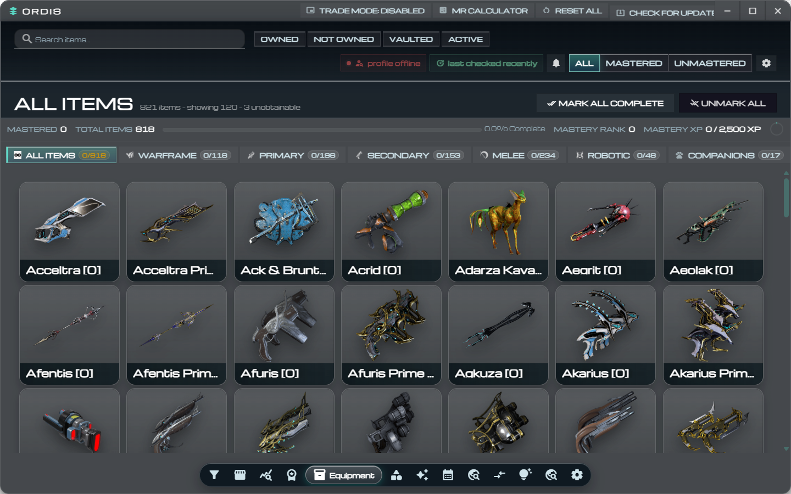
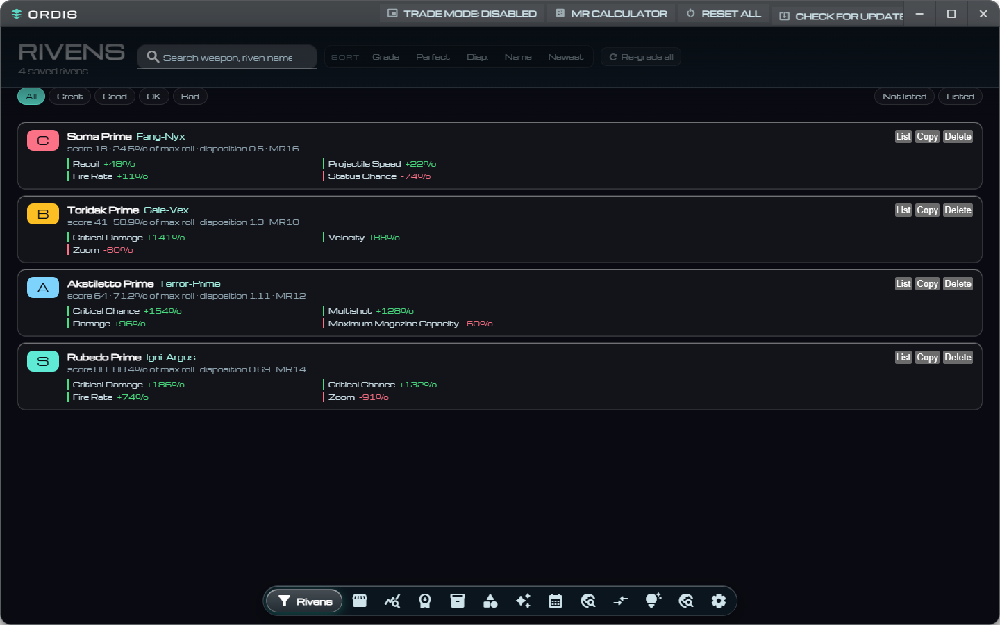

<table>
  <tr>
    <td width="96" valign="top">
      
    </td>
    <td valign="top">
      <h1>Ordis</h1>
      <p>
        A complete free and open source program to track your mastery and see what is tradable or not with many
        feature all in one app.
      </p>
    </td>
  </tr>
</table>

<p>
  <a href="https://github.com/Kawaoii/Ordis">Repository</a> |
  <a href="https://github.com/Kawaoii/Ordis/issues">Report an Issue</a> |
  <a href="#features">Features</a> |
  <a href="#installation">Installation</a> |
  <a href="#build-and-release">Build and Release</a> |
  <a href="./CONTRIBUTING.md">Contributing</a>
</p>

> [!IMPORTANT]
> **Ordis is an unofficial fan fork.**
>
> It is based on [Warframe Companion App](https://github.com/Hasan580/Warframe-companion-app)
> by **Hassan F.**, released under an MIT-Style License With Repository Attribution, which
> requires visible attribution to the original project.
>
> All original credit for the base project goes to Hassan F. This fork is maintained
> independently and is **not affiliated with or endorsed by Digital Extremes**.

## Overview

Ordis is an Electron desktop utility focused on quality-of-life workflows for Warframe players:

- Track mastered and unmastered items by category
- Search and filter large item collections quickly
- View item details, drops, and crafting requirements
- Trade on Warframe.market, including managing your own live orders
- Grade rivens as you reroll them and keep the results in one list
- Monitor Prime Resurgence and worldstate information
- Use the MR Calculator and progress stats to plan mastery goals

## Features

- Category-driven item explorer with full-bleed artwork
- Mastery progression ring and completion metrics
- Real-time filters for owned, unowned, vaulted, and active items
- Item detail modal with acquisition and crafting context
- **Warframe.market** integration
  - Sign in with a browser login or a personal access token
  - Live sell and buy orders, whisper copy, and market statistics
  - Your own orders, with hide, show, and delete
  - **My Orders**, with part counts for set components you already own
- **Riven grading**
  - Watches `EE.log` for a reroll and reads the stat panel on screen
  - Grades against the 44bananas community sheet and the weapon's disposition
  - Reports perfectness, the percentage of the best possible roll
  - Every scan is filed into a **Rivens** tab, sorted by grade, perfectness, or disposition
  - Post a saved riven to Warframe.market, or copy the trade string
- Prime Resurgence, Relics, Arcanes, Cycles, and Star Chart panels
- Floating, snapping, tiled panels driven by the dock strip
- Native Electron window controls and update checks

## Application Preview



The Rivens tab, where every graded riven is filed:



## Tech Stack

- Electron
- Vanilla JavaScript (CommonJS)
- HTML
- CSS
- electron-builder

## Public APIs Used

This project uses public community and game-related APIs, including:

- [WarframeStat](https://github.com/WFCD)
- [warframe.market](https://warframe.market/api_docs)
- GitHub Releases API for app updates

## Installation

### Prerequisites

- Node.js 18+
- npm 9+

### Local development

```bash
npm install
npm run dev
```

## Build and Release

### Standard Windows build

```bash
npm run build
```

### Other useful commands

```bash
npm run package
```

## Project Structure

```text
assets/                     App icon, screenshots, and bundled fonts
docs/                       Architecture notes, changelog, dock reference
index.html                  Main UI markup
styles.css                  Legacy base styling
ordis-design.css            Design system: tokens, glass, rounding, panels
renderer.js                 UI logic and data integration
market.js                   Warframe.market panel behaviour
riven-data.js               Riven grade sheet, dispositions, grading engine
riven-parser.js             OCR text -> riven stat parsing
main.js                     Electron main process, riven scanning, IPC
preload.js                  Electron preload bridge
dock.js                     Floating, snapping, tiled panel management
verify-riven-bases.js       Checks riven base values against the wiki
```

## Credits

- [44bananas](https://docs.google.com/spreadsheets/d/1zbaeJBuBn44cbVKzJins_E3hTDpnmvOk8heYN-G8yy8)
  for the riven grade sheet that the riven grading is built on
- The [WARFRAME Wiki](https://wiki.warframe.com/w/Riven) for the documented riven
  attribute value formula and base values
- **Michroma** by the Michroma Project Authors, under the
  [SIL Open Font License 1.1](./assets/fonts/OFL.txt)

## Contributing

Contributions are welcome. Read [CONTRIBUTING.md](./CONTRIBUTING.md) before opening a pull request.

## Code of Conduct

Please follow the guidelines in [CODE_OF_CONDUCT.md](./CODE_OF_CONDUCT.md).

## Disclaimer

Ordis is a community-built, unofficial fan project. It is not affiliated with, sponsored by,
or endorsed by Digital Extremes. Warframe, Ordis, and related names are trademarks of
Digital Extremes Ltd. No affiliation or endorsement is implied.

Data is supplied by community APIs including [WarframeStat](https://github.com/WFCD) and
[warframe.market](https://warframe.market). Use them at your own risk and respect their terms.

## License

This project is a fork of [Warframe Companion App](https://github.com/Hasan580/Warframe-companion-app)
by **Hassan F.**, distributed under an
[MIT-Style License With Repository Attribution](./LICENSE).

That licence permits redistribution and modification, provided visible attribution to the
original repository is given. This fork retains that requirement: the original copyright
notice, licence text, and attribution are preserved in this README, in the in-app Settings
footer, and in the release notes. The upstream `LICENSE` file is left unmodified.
